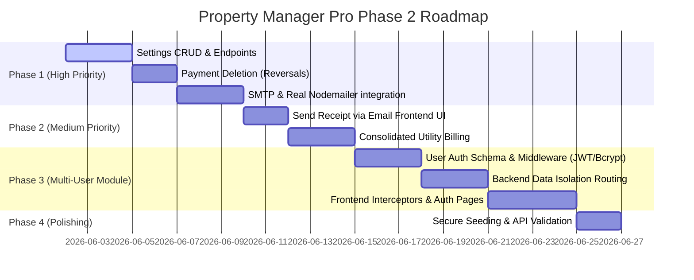

# Property Manager Pro — Development & Enhancement Plan 🏢

This document outlines the current state of **Property Manager Pro** (what has been built and successfully integrated) and proposes a structured roadmap for future enhancements, addressing unfinished features, user experience improvements, and robust backend capabilities.

---

## 📊 1. Current State (What Has Been Done)

Property Manager Pro is built on a robust, state-of-the-art MERN (MongoDB, Express, React, Node.js) stack with an automated local mock failover database (`mock_db.json`) ensuring 100% development uptime. The UI is designed with the premium **BankDash** aesthetic (Premium Blue `#2D60FF`, custom Sora/Outfit typography, smooth micro-interactions).

### 🖥️ Frontend Architecture & Design
* **Design System**: Fully modular Vanilla CSS system utilizing variables for HSL colors, responsive tables, flex grids, and dynamic CSS transitions (`index.css`).
* **State Management**: React Context (`StateContext.jsx`) hydrates the frontend with full database records (properties, apartments, tenants, payments, settings, unit types, contracts, utilities) in a single unified fetch on mount.
* **Responsive Layout**: Sidebar (`Sidebar.jsx`) and Header (`Header.jsx`) navigation with toggle overlays for seamless mobile responsiveness.

### 🧩 Feature Implementations
1. **Portfolio Dashboard (`Dashboard.jsx`)**:
   * Summary KPI cards showing Active Tenants, Collected Rent (summarized from payment history), and Outstanding Arrears.
   * "Recent Transactions" table tracking the latest rent payments with avatar generation.
2. **Properties & Units Manager (`Properties.jsx`)**:
   * Complete property CRUD (Create, Read, Update, Delete) with safety confirmation modals.
   * Unit/Apartment registry nested under each property showing unit types, active tenant occupancy status, and quick unit deletion.
3. **Tenant Registry (`Tenants.jsx`)**:
   * Tenant profile management (Rent amount, lease details, email, phone, due dates).
   * Smart status computation using `calculateRentStatus` (marks tenants as Paid, Overdue, or Due Soon).
   * Dynamic property-to-unit cascading dropdowns in modals (hiding occupied units).
4. **Intelligent Leasing Contracts (`Contracts.jsx`)**:
   * Custom contract terms, startDate, endDate, and agreed payment day.
   * Automated payment day logic (caps the due date to the last day of shorter months, e.g., Feb 28th/29th).
   * Real-time due date preview in modals during contract creation.
5. **Multi-Service Utilities Auditor (`Utilities.jsx`)**:
   * Consumption tracking for Electricity (Zap ⚡), Water (Droplet 💧), and Gas (Flame 🔥).
   * Live math calculation engine (`units consumed × rate = amount`) instantly updated in form state.
   * One-click bidirectional paid/unpaid toggles with dynamic stat-grid re-evaluation.
6. **Payment Ledger & Receipts (`Payments.jsx`)**:
   * 19-month rolling grid calendar showing paid/unpaid/advance months.
   * Multimonth bulk payment registration.
   * High-fidelity standalone HTML receipt generator (optimized for browser print layouts).

---

## 🛠️ 2. Proposed Improvements & Missing Features (What Needs to Be Done)

During the audit of the code, several critical visual buttons were identified as static mock-ups without functionality, and corresponding API endpoints were missing. Below is a prioritized list of proposed enhancements.

### 🔴 High Priority: Unfinished UI Handlers & Missing Endpoints

#### A. Managed Unit Categories CRUD (Settings)
* **Problem**: The "Managed Unit Categories" card in `Settings.jsx` renders categories but the **Add** input/button and the **Trash/Delete** buttons are static with no handlers. No unit category endpoints exist in the backend.
* **Proposed Solution**:
  * Implement frontend click handler for **Add Category** and **Delete Category** inside `Settings.jsx`.
  * Add backend endpoints:
    * `POST /api/unit_types` (adds a category to MongoDB or `mock_db.json`).
    * `DELETE /api/unit_types/:id` (removes a category).
  * Update `StateContext` to provide updater methods for categories.

#### B. Payment History Deletion (Reverse Payments)
* **Problem**: The payment ledger in `Payments.jsx` displays a trash can icon next to payments, but it has no handler. If a property manager records a payment by mistake, there is no way to delete or reverse it.
* **Proposed Solution**:
  * Add click handler to the **Delete** button in `Payments.jsx` that prompts a safety confirmation modal.
  * Add backend endpoint:
    * `DELETE /api/payments/:id`
  * Ensure that when a payment is deleted, the system re-evaluates the tenant's `lastPaidMonth` (reverting it to the previous payment month if applicable).

#### C. SMTP Configuration & Test Email
* **Problem**: The SMTP Configuration card in `Settings.jsx` is fully rendered, but clicking **Save SMTP** and **Test** has no actual effect. There are no backend SMTP config retrieval/saving endpoints.
* **Proposed Solution**:
  * Add backend endpoints:
    * `GET /api/smtp-settings` (reads saved credentials from the `Setting` collection).
    * `POST /api/smtp-settings` (writes SMTP details securely).
  * Configure Nodemailer in `server.js` to dynamically use the saved SMTP configuration to send **real email receipts** instead of the current simulated terminal log.
  * Connect the **Test** button in the frontend to trigger a test email to the logged-in administrator.

---

### 🟡 Medium Priority: User Experience & Workflow Enhancements

#### D. "Send Receipt" Button Integration
* **Problem**: Receipts can only be printed locally. Managers cannot email a copy directly to the tenant's registered email.
* **Proposed Solution**:
  * In the Receipt Preview modal in `Payments.jsx`, add a **Send Email** button.
  * When clicked, make an API request to the backend's `/api/send-receipt` endpoint, attaching the tenant's email, a clean HTML body representing the receipt, and sending it using the configured SMTP settings.

#### E. Consolidated Utility Billing
* **Problem**: Utilities and rent are billed in separate pages. Managers have to go to the `Utilities` page to pay utility bills, then to the `Payments` page to record rent.
* **Proposed Solution**:
  * In the **Register Payment** modal on the `Payments.jsx` page, show a list of **outstanding unpaid utilities** for the selected tenant.
  * Allow managers to check a box to "Pay Outstanding Utilities" alongside rent in a single unified cash register action.

#### F. Unified Currency & Settings Propagation
* **Problem**: Changing currency in Settings changes state globally, but some currency-related inputs do not automatically re-sync without a manual refresh.
* **Proposed Solution**:
  * Bind all currency strings in text inputs and card headers directly to `state.settings.currency` via React Context so any setting shift instantly recalculates and updates the entire dashboard visual layout.

---

### 🔵 Low Priority: Security & Performance Optimizations

#### G. Secure Seed Endpoint Protection
* **Problem**: `/api/seed` completely resets the MongoDB database. If this route is accessed in production, it will wipe all real property data.
* **Proposed Solution**:
  * Require a secret administrator token header or query parameter (e.g., `?secret=pm_dev_2026`) to activate the seed reset logic.

#### H. Input Validation Schema
* **Problem**: Modals perform basic string-length validations, but no robust backend schemas protect the API from receiving malformed data.
* **Proposed Solution**:
  * Integrate Joi or express-validator schemas on the backend for all `POST`/`PUT` endpoints.

---
---

## 👥 3. Multi-User Management & Authentication Module (Roadmap & Architectural Guide)

To transition Property Manager Pro from a single-manager tool to a secure, multi-tenant platform where each manager signs in and manages only their assigned properties, we need to implement a **User Authentication** and **Data Isolation** module. 

Below is the step-by-step implementation guide for both backend and frontend layers.

### 🗄️ A. Database Schema Updates (`backend/models.js`)
We must establish a `User` entity and link all properties to a specific `userId`.

1. **Create the User Schema**:
   ```javascript
   const UserSchema = new mongoose.Schema({
       id: { type: String, required: true, unique: true },
       name: { type: String, required: true },
       email: { type: String, required: true, unique: true, lowercase: true },
       password: { type: String, required: true }, // Hashed using bcryptjs
       createdAt: { type: Date, default: Date.now }
   });
   module.exports.User = mongoose.model('User', UserSchema);
   ```

2. **Establish the Ownership Link (Property Schema)**:
   Modify the `PropertySchema` to require a `userId` reference:
   ```javascript
   const PropertySchema = new mongoose.Schema({
       id: { type: String, required: true, unique: true },
       name: { type: String, required: true },
       address: { type: String },
       userId: { type: String, ref: 'User', required: true } // Linking property to manager
   });
   ```
   *Note: Apartments, tenants, contracts, utilities, and payments will be isolated transitively through their parent Property relationship.*

---

### 🛡️ B. Secure Authentication & Middleware (`backend/server.js`)
We will use JSON Web Tokens (JWT) for session management and `bcryptjs` for encryption.

1. **Authentication Endpoints**:
   * `POST /api/auth/signup`: Hashes the password using `bcryptjs`, saves the user, and generates a JWT token.
   * `POST /api/auth/login`: Authenticates user credentials and returns the JWT token.
2. **Auth Middleware (`auth.js`)**:
   Create a middleware to verify incoming requests and attach `req.userId` to the request object:
   ```javascript
   const jwt = require('jsonwebtoken');
   const authMiddleware = (req, res, next) => {
       const token = req.headers.authorization?.split(' ')[1];
       if (!token) return res.status(401).json({ error: 'Access denied. No token provided.' });
       try {
           const decoded = jwt.verify(token, process.env.JWT_SECRET || 'fallback_secret');
           req.userId = decoded.userId;
           next();
       } catch (e) {
           res.status(400).json({ error: 'Invalid token.' });
       }
   };
   ```

---

### 🔒 C. Data Isolation (Transitive Data Querying)
To ensure managers cannot access other managers' records, we must filter all GET and write operations using `req.userId`.

* **Unified Fetch Route (`GET /api/data`) Update**:
  ```javascript
  app.get('/api/data', authMiddleware, async (req, res) => {
      try {
          // 1. Fetch only properties owned by the logged-in manager
          const properties = await Property.find({ userId: req.userId }).lean();
          const propertyIds = properties.map(p => p.id);

          // 2. Query child records based only on those property IDs
          const apartments = await Apartment.find({ propertyId: { $in: propertyIds } }).lean();
          const apartmentIds = apartments.map(a => a.id);

          const tenants = await Tenant.find({ apartmentId: { $in: apartmentIds } }).lean();
          const tenantIds = tenants.map(t => t.id);

          const [payments, contracts, utilities] = await Promise.all([
              Payment.find({ tenantId: { $in: tenantIds } }).sort({ date: -1 }).lean(),
              Contract.find({ tenantId: { $in: tenantIds } }).lean(),
              Utility.find({ apartmentId: { $in: apartmentIds } }).lean()
          ]);

          const settingsRows = await Setting.find({ userId: req.userId }).lean();
          const settings = {};
          settingsRows.forEach(row => settings[row.key] = row.value);

          res.json({ properties, apartments, tenants, payments, settings, contracts, utilities });
      } catch (e) {
          res.status(500).json({ error: e.message });
      }
  });
  ```

---

### 🖥️ D. Frontend UI Integration (`frontend/src`)
1. **Extend global state (`StateContext.jsx` or `AuthContext.jsx`)**:
   Add authentication state and request interceptors to automatically attach the secure authorization token:
   ```javascript
   const token = localStorage.getItem('token');
   if (token) {
       axios.defaults.headers.common['Authorization'] = `Bearer ${token}`;
   }
   ```
2. **Dedicated Premium Login & Signup Page (`Login.jsx`, `Signup.jsx`)**:
   * Build beautiful, animated inputs matching the Sora & Outfit modern typography styles.
   * On successful login, save the JWT token in `localStorage`, set state, and navigate to `/`.
3. **Route Protection**:
   * Wrap dashboard and manager routes with an `<ProtectedRoute>` component that redirects unauthenticated guests back to the Login screen.

---

## 📈 4. Implementation Roadmap & Timeline



### Next Immediate Action Items (Completed):
1. Update `backend/server.js` and `backend/models.js` to support SMTP and Unit Category endpoints.
2. Update `frontend/src/pages/Settings.jsx` to bind handlers for adding/deleting categories and saving SMTP.
3. Update `frontend/src/pages/Payments.jsx` to wire up the payment deletion flow.
4. Prepare multi-user schemas and authorization routes for implementation after core features are stable.

---

## 🔐 5. Google Sign-In Integration (OAuth 2.0)

To provide a convenient, modern sign-in method, we will integrate Google Sign-In as an alternative to email/password authentication.

### Key Components:
1. **Frontend Client Integration**:
   * Include the official Google Identity Services client script in `index.html`.
   * Add standard styled Google Sign-In buttons to both `Login.jsx` and `Signup.jsx`.
   * Pass Google JWT credentials to the backend.
2. **Backend Verification Endpoint (`POST /api/auth/google`)**:
   * Install `google-auth-library` on the backend.
   * Securely verify incoming identity tokens using Google's public certificates.
   * Handle user lookup or auto-creation (including seeding default settings for new Google accounts).
   * Return application JWT session tokens.


